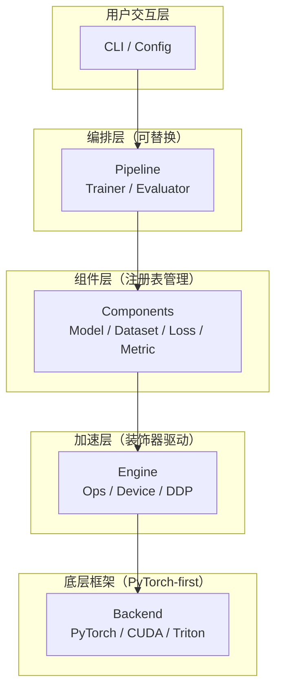
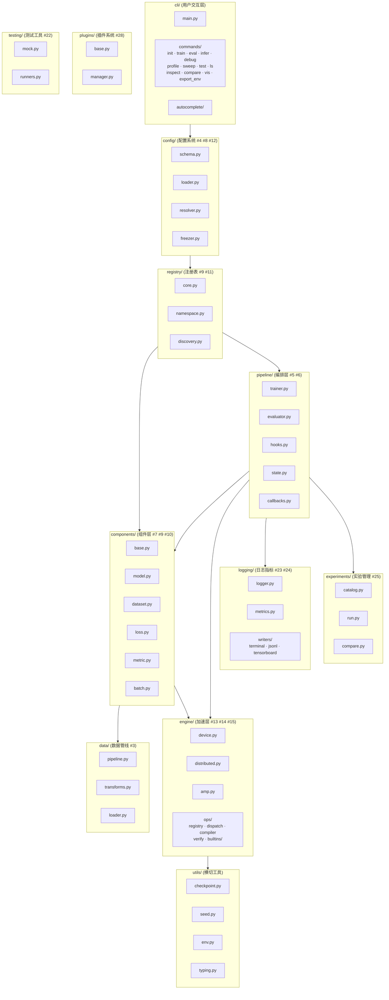
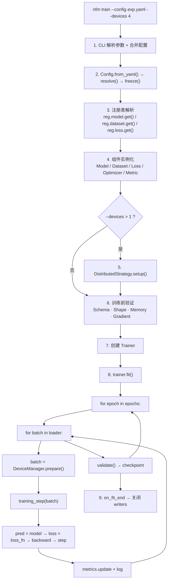

# NameFrame 技术架构

> 基于 `docs/philosophies.md` 设计原则，定义 NameFrame 的完整技术架构。

---

## 一、架构总览

### 1.1 五层模型

```
CLI / Config         → 无依赖（仅被下层引用）
Pipeline             → 依赖 Components、Engine
Components           → 依赖 Engine
Engine               → 依赖 Backend
Backend (PyTorch)    → 外部依赖
```

每层只依赖直接下层。跨层访问通过 `unsafe_` 前缀的穿透 API 暴露（哲学 #6）。



### 1.2 包结构



### 1.3 关键设计决策

| 决策 | 选择 | 理由 |
|------|------|------|
| 后端框架 | PyTorch-only | 哲学 #29：不做跨框架抽象 |
| CLI 框架 | Typer | 原生支持类型注解、自动生成 help、shell 补全 |
| 配置格式 | YAML + include | 用户友好、可 diff、层级分明 |
| 不可变配置 | 自定义 `freeze()` | 不依赖 `frozen dataclass`，报错携带精确来源位置 |
| 注册方式 | 装饰器 + 自动发现 | 哲学 #11：零样板注册 |
| 插件发现 | Python entry_points | 安装即激活，无需额外配置 |
| 日志渲染 | rich | 终端颜色、进度条、实时面板 |
| 分布式 | 策略模式 | DDP / FSDP / DeepSpeed 统一接口 |

---

## 二、核心抽象

### 2.1 Registry（哲学 #11）

注册表是框架的中心骨架。所有可替换组件类型各持一个 Registry 实例。

```python
# nameframe/registry/core.py

class Registry:

    def __init__(self, name: str, base_type: type | None = None):
        self.name = name
        self.base_type = base_type
        self._items: dict[str, type] = {}
        self._namespaces: dict[str, "Registry"] = {}

    def register(self, name: str | None = None):
        def decorator(cls):
            key = name or _camel_to_snake(cls.__name__)
            self._items[key] = cls
            return cls
        return decorator

    def get(self, name: str) -> type:
        if ":" in name:
            ns, key = name.split(":", 1)
            return self._namespaces[ns].get(key)
        if name not in self._items:
            raise RegistryKeyError(
                f"'{name}' not in {self.name} registry table."
                f"Available: {list(self._items.keys())}"
            )
        return self._items[name]

    def discover(self, directory: Path) -> None:
        for f in directory.rglob("*.py"):
            if f.name == "__init__.py":
                continue
            _import_module_from_path(f)

    def list_all(self, namespace: str | None = None) -> dict[str, type]:
        ...

# usage
model   = Registry("model")
dataset = Registry("dataset")
loss    = Registry("loss")
metric  = Registry("metric")
ops     = Registry("ops")
plugin  = Registry("plugin")
```

三种注册方式对应哲学 #11：

1. 自动发现（零代码）文件位于 my_project/model/my_vit.py → 自动注册为 "my_vit"
2. 装饰器注册（一行代码）
3. 函数式注册（接入第三方）

```python
@reg.model.register("my_vit")
class MyViT(nn.Module): ...

reg.model.register("resnet50", torchvision.models.resnet50)
```

**命名空间**：通过 `:` 分隔符隔离不同项目的同名模块，如 `proj_a:resnet` 和 `proj_b:resnet` 互不冲突。

**延迟加载**：`import` 时仅触发注册，`get()` 才验证类型。大型模型只有被选中时才加载权重。

### 2.2 Config（哲学 #4, #8, #12）

```python
# nameframe/config/loader.py

class Config:

    @classmethod
    def from_yaml(cls, path: Path, overrides: dict | None = None) -> "Config":
        raw = _load_yaml_with_includes(path)
        if overrides:
            raw = _deep_merge(raw, overrides)
        return cls(raw)

    def resolve(self) -> None:

    def freeze(self) -> None:

    @property
    def is_frozen(self) -> bool: ...

    def get_namespace(self, ns: str) -> dict:

    def to_dict(self) -> dict:


# nameframe/config/freezer.py
class FrozenConfigError(Exception):
    def __init__(self, key: str, location: str):
        super().__init__(
            f"Config '{key}' frozen and banned changes from {location}"
        )


# nameframe/config/schema.py

class FieldSchema(TypedDict, total=False):
    type: type
    default: Any
    help: str
    choices: list | None
    range: tuple[float, float] | None
    nullable: bool
```

**配置命名空间约定**：

```yaml
model:                  # → 传递给 Model 组件
  name: resnet50
  num_layers: 12
training:               # → Pipeline 编排配置
  lr: 1e-3
  batch_size: 64
  epochs: 100
  loss: cross_entropy
  optimizer: adamw
data:                   # → 传递给 Dataset 组件
  name: cifar10
  path: /data/cifar10
  augment: true
engine:                 # → Engine 层配置
  devices: 4
  strategy: ddp
  amp: true
logging:                # → 日志配置
  log_every: 10
  writers: [terminal, jsonl]
plugins:                # → 插件加载列表
  - wandb
```

**冻结时机**：配置解析完成、模型初始化之前。`nfm debug` 模式可通过 `--no-freeze` 跳过（终端打印警告）。

### 2.3 Batch（哲学 #3, #14）

`Batch` 是不可变数据对象（frozen dataclass），是组件之间唯一的通信载体，其to方法是唯一的 device 转换点。组件不能修改它，只能读取并产出新结果。数据管的流体隐喻（哲学 #3）在代码层面体现为：各组件对 Batch 做纯函数变换，不产生副作用。

```python
# nameframe/components/batch.py

@dataclass(frozen=True)
class Batch:
    data: Tensor
    target: Tensor | None = None
    meta: dict = field(default_factory=dict)

    def to(self, device: torch.device) -> "Batch":
        return Batch(
            data=self.data.to(device),
            target=self.target.to(device) if self.target is not None else None,
            meta=self.meta,
        )
```

### 2.4 RegisteredModule（哲学 #12）

RegisteredModule 是所有可注册组件的基类。其具有的两个类方法可以从配置的某个命名空间实例化组件，且允许其对比 params 与 config_schema，给出精确的错误提示。

```python
# nameframe/components/base.py

class RegisteredModule:
    config_schema: dict[str, FieldSchema] = {}

    @classmethod
    def from_config(cls, config: Config, namespace: str) -> "RegisteredModule":
        params = config.get_namespace(namespace)
        cls._validate_against_schema(params)
        return cls(**params)

    @classmethod
    def _validate_against_schema(cls, params: dict) -> None:
        for key, schema in cls.config_schema.items():
            if key not in params and "default" not in schema:
                raise ConfigValidationError(
                    f"Missing config '{key}'。"
                    f"Help: {schema.get('help', 'None')}"
                )
        for key in params:
            if key not in cls.config_schema:
                suggestion = _find_closest_match(key, cls.config_schema.keys())
                raise ConfigValidationError(
                    f"Unknown config '{key}'。"
                    f"Try '{suggestion}'?"
                )
```

---

## 三、组件系统（Components 层）

### 3.1 Model（哲学 #9）

ModelProtocol 是Model 最小接口。

```python
# nameframe/components/model.py

class ModelProtocol(Protocol):
    config_schema: dict

    def forward(self, batch: Batch) -> Tensor: ...
    def parameters(self) -> Iterator[Parameter]: ...
    def state_dict(self) -> dict: ...
    def load_state_dict(self, state_dict: dict, strict: bool = True) -> None: ...
```

框架不强制继承特定基类。满足 protocol 即可。实践中继承 `nn.Module` 并 mixin `RegisteredModule`。

```python
@reg.model.register("my_vit")
class MyViT(nn.Module, RegisteredModule):
    config_schema = {
        "num_layers":  {"type": int, "default": 12, "help": "int, transformer layers"},
        "hidden_dim":  {"type": int, "default": 768, "help": "int, hidden dims"},
        "num_heads":   {"type": int, "default": 12, "help": "int, num of attention heads"},
    }

    def __init__(self, num_layers=12, hidden_dim=768, num_heads=12):
        super().__init__()
        ...

    def forward(self, batch: Batch) -> Tensor:
        return self.encoder(batch.data)
```

Model 不引用 Dataset、不引用 Loss、不引用 Optimizer（哲学 #7, #10）。

### 3.2 Dataset（哲学 #3, #18, #26）

Dataset 类具有数据集身份指纹，由文件列表哈希和 transform 签名组成。另外，可查询其变换列表。mode='infer' 时自动排除 augmentation_transforms。

```python
# nameframe/components/dataset.py

class Dataset(RegisteredModule, torch.utils.data.Dataset):
    config_schema = {
        "path":    {"type": str, "help": "str, dataset root path"},
        "augment": {"type": bool, "default": True, "help": "bool, if augment dataset."},
    }

    augmentation_transforms: list[Callable] = []

    def fingerprint(self) -> str:
        ...

    def transforms(self, mode: str = "train") -> list[Callable]:
        base = self._base_transforms()
        if mode == "infer":
            return base
        return base + self.augmentation_transforms
```

`augmentation_transforms` 是训练专用变换。`nfm infer` 调用 `transforms(mode="infer")` 自动跳过它们。

### 3.3 Loss（哲学 #9）

```python
# nameframe/components/loss.py

class LossProtocol(Protocol):
    config_schema: dict
    def forward(self, pred: Tensor, batch: Batch) -> Tensor: ...
```

Loss 接收模型输出和原始 batch，返回标量张量。不直接访问 model、不修改 optimizer 状态。

### 3.4 Metric（哲学 #9）

MetricProtocol 负责累积一次预测结果（update）、计算并返回当前指标值（compute）、重置累积状态（reset）等。Metric 有内部状态（累积），但该状态不在组件间共享（哲学 #7）。训练时每个 epoch 开始时 `reset()`，结束时 `compute()`。

```python
# nameframe/components/metric.py

class MetricProtocol(Protocol):
    config_schema: dict

    def update(self, pred: Tensor, batch: Batch) -> None:
        ...

    def compute(self) -> dict[str, float]:
        ...

    def reset(self) -> None:
        ...
```


---

## 四、编排系统（Pipeline 层）

### 4.1 TrainingState（哲学 #16）

TrainingState 是一个可序列化的训练状态类。序列化后是纯字典，不 pickle 对象图。

```python
# nameframe/pipeline/state.py

@dataclass
class TrainingState:
    epoch: int = 0
    global_step: int = 0
    max_epochs: int = 100
    metrics_history: list[dict] = field(default_factory=list)
    best_metric: float | None = None
    best_epoch: int | None = None
    should_stop: bool = False
```

### 4.2 Trainer（哲学 #5, #6）

Trainer 是默认训练器，默认应覆盖大多数情况的需求。其方法 fit 是主训练循环，training_step 是单步训练，用户可覆写此方法（哲学 #5 进阶用法）。

```python
# nameframe/pipeline/trainer.py

class Trainer:
    def __init__(
        self,
        model: ModelProtocol,
        train_dataset: Dataset,
        val_dataset: Dataset | None,
        loss_fn: LossProtocol,
        optimizer: torch.optim.Optimizer,
        scheduler: object | None,
        metrics: list[MetricProtocol],
        config: Config,
        state: TrainingState | None,
        callbacks: list[Callback],
        device_manager: DeviceManager,
        logger: StructuredLogger,
    ): ...

    def fit(self) -> TrainingState:
        self._run_callbacks("on_fit_start")

        for self.state.epoch in range(self.state.epoch, self.state.max_epochs):
            self._run_callbacks("on_epoch_start")
            self._train_epoch()
            val_metrics = self._validate_epoch()
            self._run_callbacks("on_epoch_end")

            if self.state.should_stop:
                break

        self._run_callbacks("on_fit_end")
        return self.state

    def training_step(self, batch: Batch) -> dict:
        pred = self.model(batch)
        loss = self.loss_fn(pred, batch)
        self.optimizer.zero_grad()
        loss.backward()
        self.optimizer.step()
        return {"loss": loss, "pred": pred}

    def _train_epoch(self) -> None:
        for batch in self._train_loader:
            batch = self.device_manager.prepare_batch(batch)
            self._run_callbacks("on_batch_start", batch, self.state.global_step)
            outputs = self.training_step(batch)
            self._run_callbacks("on_batch_end", outputs, self.state.global_step)
            self.state.global_step += 1
```

### 4.3 Hook 系统（哲学 #5）

Callback 类是 Hook 基类。通过继承注入逻辑，不修改 Trainer 源码。该类内置 Callbacks：`EarlyStopping`、`LRSchedulerBridge`、`GradientClipping`、`ModelCheckpoint`。

```python
# nameframe/pipeline/hooks.py

class Callback:
    def on_fit_start(self, trainer: "Trainer") -> None: ...
    def on_fit_end(self, trainer: "Trainer") -> None: ...
    def on_epoch_start(self, trainer: "Trainer") -> None: ...
    def on_epoch_end(self, trainer: "Trainer") -> None: ...
    def on_batch_start(self, batch: Batch, step: int) -> None: ...
    def on_batch_end(self, outputs: dict, step: int) -> None: ...
    def on_before_forward(self, batch: Batch) -> None: ...
    def on_after_forward(self, pred: Tensor) -> None: ...
    def on_before_backward(self, loss: Tensor) -> None: ...
    def on_after_backward(self) -> None: ...
    def on_checkpoint_save(self, ckpt: dict) -> None: ...
    def on_checkpoint_load(self, ckpt: dict) -> None: ...
```

### 4.4 穿透 API（哲学 #6）

具有 unsafe_ 开头的前缀。unsafe_get_raw_dataloader 方法获取原始 DataLoader，unsafe_get_raw_model 获取未 DDP 包装的原始模型。仅用于框架无法覆盖的极端场景。

```python
def unsafe_get_raw_dataloader(trainer: Trainer) -> DataLoader: ...

def unsafe_get_raw_model(trainer: Trainer) -> nn.Module: ...
```

---

## 五、加速系统（Engine 层）

### 5.1 算子多后端派发（哲学 #13）

dispatch_backend 是装饰器函数，负责声明算子的多后端实现。

```python
# nameframe/engine/ops/dispatch.py

class Backend(Enum):
    CUDA = "cuda"
    TRITON = "triton"
    CPP = "cpp"
    PYTHON = "python"

BACKEND_PRIORITY = [Backend.CUDA, Backend.TRITON, Backend.CPP, Backend.PYTHON]

def dispatch_backend(**backends: str | Callable):
    def decorator(func):
        dispatcher = OpDispatcher(func.__name__, backends)
        return dispatcher
    return decorator

class OpDispatcher:
    def __init__(self, name: str, backends: dict[str, str | Callable]):
        self.name = name
        self._backends = backends
        self._compiled: dict[Backend, Callable] = {}

    def __call__(self, *args, **kwargs) -> Tensor:
        device = self._infer_device(args)
        backend = self._select_best_backend(device)
        impl = self._load_or_compile(backend)
        return impl(*args, **kwargs)

    def _select_best_backend(self, device: torch.device) -> Backend:
        for b in BACKEND_PRIORITY:
            if b in self._backends and self._is_available(b, device):
                return b
        return Backend.PYTHON

    def _load_or_compile(self, backend: Backend) -> Callable:
        if backend not in self._compiled:
            self._compiled[backend] = self._compile(backend)
        return self._compiled[backend]
```

**使用示例**：

```python
@reg.ops.register("gelu")
@dispatch_backend(
    cuda="my_project/ops/gelu.cu",
    triton="my_project/ops/gelu_triton.py",
    python=lambda x: x * torch.sigmoid(1.702 * x),
)
def gelu(x: Tensor) -> Tensor:
    ...
```

**派发链**：检查设备 → 尝试 CUDA → 不可用时尝试 Triton → 不可用时尝试 C++ 扩展 → fallback 到 Python 实现。

**编译缓存**：CUDA/C++ 源码编译后缓存到 `.nameframe/cache/`，第二次运行零开销。

**算子验证**（哲学 #13 约束）：

```bash
nfm verify-ops  # 对比所有已注册算子的各后端输出精度
```

### 5.2 Device 管理（哲学 #14）

DeviceManager 集中管理数据的设备属性。保证数据只做一次 .to(device)。prepare_batch 是唯一的 device 转换调用点，所有数据在 `DataLoader` 出口完成 device placement，pipeline 中其他位置不再出现 `.to(device)`。

```python
# nameframe/engine/device.py
class DeviceManager:
    def __init__(self, config: Config):
        self.device = self._resolve_device(config)

    def prepare_batch(self, batch: Batch) -> Batch:
        return batch.to(self.device)
```

### 5.3 分布式训练（哲学 #15）

DistributedStrategy 是分布式策略接口，其依靠配置切换而非代码重写。用户代码不需出现分布式原语，如 `rank`、`barrier()`、`all_reduce`（哲学 #15）。

```python
# nameframe/engine/distributed.py

class DistributedStrategy(ABC):
    @abstractmethod
    def setup(self, config: Config) -> None: ...
    @abstractmethod
    def wrap_model(self, model: nn.Module) -> nn.Module: ...
    @abstractmethod
    def create_sampler(self, dataset: Dataset) -> Sampler: ...
    @abstractmethod
    def reduce_metrics(self, metrics: dict) -> dict: ...
    @abstractmethod
    def cleanup(self) -> None: ...


class DDPStrategy(DistributedStrategy):
    """PyTorch DistributedDataParallel."""

class FSDPStrategy(DistributedStrategy):
    """PyTorch FullyShardedDataParallel."""

class DeepSpeedStrategy(DistributedStrategy):
    """DeepSpeed ZeRO-1/2/3."""


STRATEGIES: dict[str, type[DistributedStrategy]] = {
    "ddp": DDPStrategy,
    "fsdp": FSDPStrategy,
    "deepspeed": DeepSpeedStrategy,
}
```

**使用方式**：

```bash
nfm train --config exp.yaml --devices 4             # DDP
# config: engine.strategy: fsdp                      # 切换策略
```

### 5.4 混合精度（AMP）

AMPManager 支持混合精度训练（gradient scaling + autocast）。配置中 `engine.amp: true` 即可开启。对 Trainer 透明。

```python
# nameframe/engine/amp.py

class AMPManager:
    def __init__(self, config: Config): ...
    def autocast_context(self) -> ContextManager: ...
    def scale_loss(self, loss: Tensor) -> Tensor: ...
    def step(self, optimizer: Optimizer) -> None: ...
```

---

## 六、数据管线（哲学 #3）

DataPipeline 类是不依赖于特定数据类型的数据管线。用 create_loader 创建 DataLoader，在出口处完成 device placement。

DataLoaderFactory 类集中创建 DataLoader，统一注入：sampler（分布式）、collate_fn、prefetch。

管道的输入输出接口完全统一（哲学 #3）。图像、文本、时序数据的预处理模块共享同一个 pipeline 骨架。

```python
# nameframe/data/pipeline.py

class DataPipeline:
    def __init__(self, dataset: Dataset, config: Config):
        self.dataset = dataset
        self.transforms = dataset.transforms(mode="train")

    def create_loader(self, batch_size: int, shuffle: bool = True) -> DataLoader:
        ...

# nameframe/data/loader.py

class DataLoaderFactory:
    @staticmethod
    def create(
        dataset: Dataset,
        batch_size: int,
        device: torch.device,
        strategy: DistributedStrategy | None,
    ) -> DataLoader: ...
```

---

## 七、CLI 系统（哲学 #2）

```python
# nameframe/cli/main.py

import typer

app = typer.Typer(name="nfm", help="NameFrame DL Frame")

@app.command()
def init(project: str, template: str = "default"):
    """init standard framework."""

@app.command()
def train(
    config: str = "config.yaml",
    devices: int = 1,
    seed: int | None = None,
    resume: bool = False,
):
    """start up training."""

@app.command()
def debug(config: str = "config.yaml"):
    """debug mode: Single batch, detailed log, NaN detection, --no-freeze."""

@app.command()
def profile(config: str = "config.yaml"):
    """performance profile: memory bar, time-consumption analysis."""

@app.command()
def evaluate(ckpt: str):
    """evaluate checkpoint."""

@app.command()
def infer(ckpt: str, input_path: str, batch: bool = False, output_dir: str | None = None):
    """single/multi-infer, enables training preprocesses defaultly."""

@app.command()
def sweep(config: str = "config.yaml", trials: int = 50, workers: int = 1):
    """hyperparam sweep searching."""

@app.command()
def test(component: str, config: str = "config.yaml"):
    """test on model | dataset | pipeline."""

@app.command()
def ls(what: str = "modules", namespace: str | None = None):
    """list on registed module and exp history."""

@app.command()
def inspect(target: str):
    """detail info about checkpoint or run."""

@app.command()
def compare(run_a: str, run_b: str):
    """compare config and metrics diff within 2 exp."""

@app.command()
def vis(what: str, **kwargs):
    """visualize on loss, model, attention."""

@app.command()
def export_env(docker: bool = False):
    """export env snapshot with/without Dockerfile."""
```

CLI 不包含业务逻辑。每个命令只做参数解析、配置合并、启动对应引擎。

---

## 八、日志与指标（哲学 #23, #24）

StructuredLogger 类支持多种输出。TerminalWriter 由 rich 库驱动，在命令行渲染漂亮输出、进度条和实时的 metrics 面板。JSONLWriter 将日志写入 .nameframe/runs/<id>/metrics.jsonl，TensorBoardWriter 是通过插件机制加载的 TensorBoard 集成。日志输出三路并行：终端（人类友好）、JSONL（机器可读）、TensorBoard/WandB（可选插件）。

```python
# nameframe/logging/logger.py

class StructuredLogger:
    def __init__(self, config: Config):
        self.writers: list[LogWriter] = self._init_writers(config)

    def log_metrics(self, metrics: dict, step: int, epoch: int) -> None:
        for w in self.writers:
            w.write_metrics(metrics, step, epoch)

    def log_info(self, msg: str) -> None: ...
    def log_warning(self, msg: str) -> None: ...
    def log_error(self, msg: str) -> None: ...


# nameframe/logging/writers/terminal.py
class TerminalWriter(LogWriter):

# nameframe/logging/writers/jsonl.py
class JSONLWriter(LogWriter):

# nameframe/logging/writers/tensorboard.py
class TensorBoardWriter(LogWriter):
```

---

## 九、实验管理（哲学 #25）

RunCatalog 类负责管理 .nameframe/runs/ 下所有实验。其具有方法 create_run 创建实验目录，返回 run_id；list_runs 列出实验，支持条件筛选；compare 对比两个实验的配置差异，并自动画出两次实验的 metrics 并排对比曲线；best 自动找出指标最优的实验。

```python
# nameframe/experiments/run.py

@dataclass
class RunMeta:
    run_id: str
    timestamp: str
    config_snapshot: dict
    env_signature: dict
    dataset_fingerprint: str
    status: str  # running | completed | failed
    metrics_summary: dict


# nameframe/experiments/catalog.py

class RunCatalog:
    def __init__(self, root: Path = Path(".nameframe/runs")): ...

    def create_run(self, config: Config) -> str:
        ...

    def list_runs(self, filter_expr: str | None = None) -> list[RunMeta]:
        ...

    def get_run(self, run_id: str) -> RunMeta: ...

    def compare(self, run_a: str, run_b: str) -> CompareResult:
        ...

    def best(self, metric: str, mode: str = "max") -> RunMeta:
        ...
```

**实验目录结构例**：

```
.nameframe/
├── runs/
│   └── 20260724-143052-a1b2c3/
│       ├── meta.json
│       ├── config.yaml          # 冻结配置快照
│       ├── metrics.jsonl        # 每步/每 epoch 指标
│       └── checkpoints/
│           ├── epoch_10.pt
│           └── best.pt
└── cache/                       # ops 编译产物
```

---

## 十、插件系统（哲学 #28）

NameFramePlugin 是插件基类，使用 pip install nameframe-* 即可激活某插件。其具有方法 on_registry 向注册表注入组件; on_config_loaded 负责在配置加载后，验证或补充插件相关配置。on_trainer_createdTrainer 在就绪后注入 callback 或修改行为。

```python
# nameframe/plugins/base.py

class NameFramePlugin:
    name: str
    version: str

    def on_registry(self, reg: Registry) -> None:
        ...

    def on_config_loaded(self, config: Config) -> None:
        ...

    def on_trainer_created(self, trainer: Trainer) -> None:
        ...


# nameframe/plugins/manager.py

class PluginManager:
    def __init__(self, config: Config):
        ...

    def load_all(self, plugin_names: list[str]) -> list[NameFramePlugin]:
        ...
```

**插件发现**：使用 Python `entry_points` 机制。`pip install nameframe-wandb` 后，配置文件里写 `plugins: [wandb]` 即可激活。

**插件生命周期**：
```
on_registry  →  on_config_loaded  →  on_trainer_created
```

---

## 十一、测试工具（哲学 #22）

MockDataGenerator 类根据 config_schema 和模型签名自动生成 mock batch。其方法generate 从 config_schema 推断 shape，生成随机 tensor；generate_like 基于真实 batch 生成同 shape 的随机数据（用于 CI 确定性测试）。

ComponentTestRunner 类负责隔离的运行组件测试。其方法 test_model 负责 shape check → forward pass → backward pass → gradient flow 的流程测试；test_dataset 验证数据管道能否产出 shape 正确的 batch；test_pipeline 验证 model + dataset + loss 全部组件，实现端到端验证。

```python
# nameframe/testing/mock.py

class MockDataGenerator:
    def __init__(self, model: ModelProtocol, dataset: Dataset): 
        ...

    def generate(self, batch_size: int = 2) -> Batch:
        ...

    def generate_like(self, real_batch: Batch) -> Batch:
        ...


# nameframe/testing/runners.py

class ComponentTestRunner:
    def test_model(self, config: Config) -> TestResult:
        ...

    def test_dataset(self, config: Config) -> TestResult:
        ...

    def test_pipeline(self, config: Config) -> TestResult:
        ...
```

对应 CLI：

```bash
nfm test model --config exp.yaml
nfm test dataset --config exp.yaml
nfm test pipeline --config exp.yaml
```

---

## 十二、训练前验证（哲学 #20, #21）

_validate_before_training 负责 9 项检查。任一失败即终止，训练 0 步也不跑。

```python
# Trainer.fit() entrance

def _validate_before_training(self) -> None:
    checks = [
        ("check config Schema", self._check_config_schema),
        ("check module exist", self._check_modules_exist),
        ("shape compatibility dry-run check", self._check_shape_compatibility),
        ("do memory estimate", self._check_memory_estimate),
        ("if loss outpus scalar", self._check_loss_is_scalar),
        ("check gradient flow",self._check_gradient_flow),
        ("check if checkpoint writable", self._check_checkpoint_path),
        ("check distribution env", self._check_distributed_health),
    ]
    for name, check in checks:
        try:
            check()
        except PreTrainValidationError as e:
            self.logger.log_error(f"[{name}] failed: {e}")
            raise


def _check_memory_estimate(self) -> None:
    estimate = MemoryEstimator(
        model=self.model,
        input_shape=self._input_shape,
        optimizer_type=type(self.optimizer),
        amp=self.config.engine.get("amp", False),
    ).estimate()

    if not torch.cuda.is_available():
        return

    free, total = torch.cuda.mem_get_info()
    if estimate.peak > free * 0.9:
        self.logger.log_warning(
            f"OOM: estimated {estimate.peak/1e9:.1f} GB, "
            f"Available {free/1e9:.1f} GB\n"
            f"Recommended: {estimate.suggestions(free)}"
        )
```

---

## 十三、Checkpoint 系统（哲学 #16, #17, #18, #19）

save_checkpoint 方法实现纯字典序列化。不 pickle 任何对象。load_checkpoint 将存档点加载为纯 dict。由调用方决定如何恢复。safe_load_state 实现安全加载权重：shape 不匹配的层跳过并警告。返回未加载的 key 列表。这确保 checkpoint 加载不因微小的架构差异而崩溃（哲学 #16）。capture_env 捕获环境签名（哲学 #19）。set_seed 实现全局种子以及各组件独立种子派生策略（哲学 #17）。derive_seed 为不同组件派生独立种子，避免偶然同步。

```python
# nameframe/utils/checkpoint.py

def save_checkpoint(
    state: TrainingState,
    model: nn.Module,
    optimizer: Optimizer,
    scheduler: object | None,
    config: Config,
    dataset: Dataset | None,
    path: Path,
) -> None:
    ckpt = {
        "version": "1.0",
        "model": model.state_dict(),
        "optimizer": optimizer.state_dict(),
        "scheduler": scheduler.state_dict() if scheduler else None,
        "state": dataclasses.asdict(state),
        "config_snapshot": config.to_dict(),
        "env_signature": capture_env(),
        "dataset_fingerprint": dataset.fingerprint() if dataset else "unknown",
        "seed_state": random.getstate(),
    }
    torch.save(ckpt, path)


def load_checkpoint(path: Path) -> dict:
    return torch.load(path, map_location="cpu", weights_only=False)
    ...


def safe_load_state(model: nn.Module, ckpt: dict, strict: bool = False) -> list[str]:
    ...

# nameframe/utils/env.py

def capture_env() -> dict:
    return {
        "python": sys.version,
        "torch": torch.__version__,
        "cuda": torch.version.cuda,
        "cudnn": torch.backends.cudnn.version(),
        "platform": platform.platform(),
    }

# nameframe/utils/seed.py

def set_seed(seed: int) -> None:
    random.seed(seed)
    np.random.seed(seed)
    torch.manual_seed(seed)
    torch.cuda.manual_seed_all(seed)
    torch.backends.cudnn.deterministic = True
    torch.backends.cudnn.benchmark = False
    ...


def derive_seed(base_seed: int, component: str, rank: int = 0) -> int:
    return base_seed + hash(component) % 10000 + rank * 1000
```

---

## 十四、类型系统

```python
# nameframe/utils/typing.py

from typing import Protocol, TypedDict, TypeVar

class BatchProtocol(Protocol):
    data: Tensor
    target: Tensor | None
    meta: dict

class ModelProtocol(Protocol):
    config_schema: dict

    def forward(self, batch: BatchProtocol) -> Tensor:
        ...

    def parameters(self) -> Iterator[Parameter]:
        ...

    def state_dict(self) -> dict:
        ...

    def load_state_dict(self, d: dict, strict: bool = True) -> None:
        ...

class LossProtocol(Protocol):
    config_schema: dict

    def forward(self, pred: Tensor, batch: BatchProtocol) -> Tensor:
        ...

class MetricProtocol(Protocol):
    config_schema: dict

    def update(self, pred: Tensor, batch: BatchProtocol) -> None:
        ...
    def compute(self) -> dict[str, float]:
        ...

    def reset(self) -> None:
        ...

class DatasetProtocol(Protocol):
    config_schema: dict
    augmentation_transforms: list

    def fingerprint(self) -> str:
        ...

    def transforms(self, mode: str) -> list[Callable]:
        ...

    def __getitem__(self, idx: int) -> BatchProtocol:
        ...

    def __len__(self) -> int: 
        ...

class FieldSchema(TypedDict, total=False):
    type: type
    default: Any
    help: str
    choices: list | None
    range: tuple[float, float] | None
    nullable: bool
    ...
```

---

## 十五、核心数据流

### 15.1 训练流程



### 15.2 推理流程

```
nfm infer <ckpt> <input_path>
  │
  ├─ 从 checkpoint 加载 config_snapshot（而非当前目录的 config.yaml）
  ├─ 从 config 重建 Dataset → .transforms(mode="infer") 跳过增强
  ├─ 加载模型权重 → safe_load_state(ckpt)
  ├─ 单 batch 前向传播
  └─ 输出结果（stdout 或写入 --output-dir）
```

训练和推理共用同一段预处理管线（哲学 #26）。

### 15.3 插件加载流程

```
nfm train --config exp.yaml      (exp.yaml 中 plugins: [wandb])
  │
  ├─ PluginManager.load_all(["wandb"])
  │   ├─ scan_entry_points("nameframe.plugins")
  │   ├─ 定位 nameframe-wandb 包
  │   ├─ plugin.on_registry(registry)
  │   ├─ plugin.on_config_loaded(config)
  │   └─ 缓存实例
  │
  └─ trainer = Trainer(...)
      └─ plugin.on_trainer_created(trainer)
```

---

## 十六、超参搜索（哲学 #27）

run_sweep 负责按照配置中声明的搜索空间，来编排超参搜索。

```yaml
# config.yaml
training:
    lr: "${search: loguniform(1e-5, 1e-2)}"
    weight_decay: "${search: choice(0, 0.01, 0.1)}"
```


```python
# nameframe/cli/commands/sweep.py

def run_sweep(config: Config, trials: int, workers: int) -> None:
    search_space = config.extract_search_space()
    sampler = create_sampler(search_space)  # grid | random | bayesian(optuna)

    for i in range(trials):
        params = sampler.sample()
        trial_config = config.with_overrides(params)
        # every trial follows standard nfm train pipeline.
        run_train(trial_config)
```

搜索结果自动编入实验管理系统（哲学 #25）。

---

## 十七、错误处理策略

| 阶段 | 错误类型 | 处理方式 |
|------|---------|---------|
| 配置解析 | `ConfigValidationError` | 指向 YAML 行号，给出可能建议 |
| 模块解析 | `RegistryKeyError` | 列出所有可用模块名 |
| 训练前验证 | `ShapeMismatchError` | 指出哪个组件的哪维 shape 不匹配 |
| 训练前验证 | 资源不足 | 警告 + 建议（减 batch_size / 开 gradient accumulation） |
| 运行时 | PyTorch 原生异常 | 附加上下文：当前 epoch、step、batch |
| 分布式 | 各 rank 错误 | rank 0 汇总报告所有 rank 的错误 |

---

## 十八、依赖图约束

```python
# 层间依赖方向（用 import-linter 强制）
#
# 允许:
#   cli → config
#   cli → pipeline
#   cli → registry
#   pipeline → components
#   pipeline → engine
#   pipeline → logging
#   pipeline → experiments
#   components → engine
#   components → data
#   engine → utils
#
# 禁止:
#   components → pipeline      # 下层不能依赖上层
#   engine → components        # 下层不能依赖上层
#   cli → engine               # 不能跨层（通过 pipeline 中转）
#   components → registry      # 组件不持有注册表引用（注册表是基础设施）
```

---

*本文档延申自 `docs/philosophies.md`。`philosophies.md` 定义设计理念，本文档给出对应技术架构。*

*最后更新：2026-07-24*
