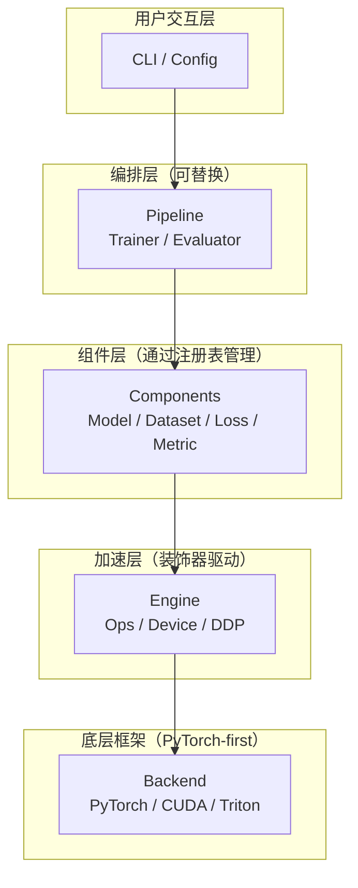

# NameFrame 设计理念

### 灵活拆/封，高度定制

**理念**：NameFrame 框架本身不应过于底层或者过于封装。NameFrame 应该提供标准化的框架，但其所有组件都应可替换、覆盖或绕过。也就是说，所有组件都应该具备可封装和可拆封两种性质，取决于用户使用需求。

> 如果用户只需修改 Loss 函数，其不应该被迫理解整个框架。

---

### CLI 是唯一入口

**理念**：初始化项目、调试、训练、评估、部署在内的所有操作都可通过 `nfm` 命令完成。CLI 必须作为框架对外的唯一接口。

```bash
nfm init <project>          # 生成标准项目骨架
nfm train [--config cfg]   # 启动训练
nfm debug [--config cfg]   # 进入调试模式（单 batch、详细日志、NaN 检测）
nfm profile [--config cfg] # 性能剖析（显存、计算瓶颈）
nfm evaluate <ckpt>            # 评估 checkpoint
nfm infer <ckpt> <input_path>   # 单次推理
```

**约束**：
- CLI 命令应是**自描述的**：`nfm train --help` 提供足以独立使用的帮助信息。
- CLI 应支持**自动补全**（bash/zsh/fish）。
- CLI 不应包含业务逻辑，只负责解析参数、合并配置、启动对应的引擎，本质上是配置的**派发层**。

---

### 数据与预处理模块的交互

**理念**：不需知晓数据格式，各种预处理模块即可发挥作用。打比方:数据是流体，预处理模块是管道。管道不需要知道流体是何种类即可传输流体。预处理模块同样不需要知晓数据格式即可处理、运输数据。这样的管道是标准化的，可以用在文本、图像、时序、多模态等各种形式的数据预处理流程中。另外，管道的输入输出两端应具备完全一致的输入、输出接口。

---

### 约定优于配置，配置优于代码

**理念**：框架必须预设合理的项目结构、默认超参和标准数据流，但所有默认值都可以通过配置文件覆盖，且配置文件中的修改不应要求改动代码。配置文件必须通过 **命名空间** 等手段对不同级别的参数和超参数实现配置解耦。越深层的参数配置，命名空间越复杂。

```bash
# 零配置跑通
nfm train   # 自动检测 dataset/model，使用全默认值

# 渐进式定制
nfm train --config <配置文件名>.yaml   # 只写你想改的部分
```

**项目目录约定**（`nfm init` 生成的结构）：

```
<项目名>/
├── config.yaml          # 配置文件（支持 include 拆分）
├── dataset/
│   └── __init__.py      # 自动发现的模块目录，支持链接导入
├── model/
│   └── __init__.py
├── loss/
│   └── __init__.py
├── ops/                 # 自定义算子（可选）
│   └── __init__.py
└── run.py               # 入口（框架自动生成，一般无需修改）
```

**关键约束**：
- 约定必须是**可发现**的。用 `nfm ls` 列出当前项目所有注册的模块，不能让用户翻目录。
- 如果约定不满足需求，应可以通过配置指定自定义路径，而非强制重构项目。

---

### 渐进式复杂度

**理念**：框架的能力谱系是平滑的，而非阶梯式的。

| 阶段 | 用户做什么 | 框架做什么 |
|------|-----------|-----------|
| 新手 | 写一个 `forward()` | 自动处理训练循环、日志、checkpoint |
| 进阶 | 自定义 loss/metric，改配置 | 自动注册、自动集成 |
| 高级 | 写自定义训练循环、自定义算子 | 提供 hook 系统，在任意节点插入逻辑 |
| 专家 | 替换底层组件（DataLoader、DDP 策略） | 所有内部 API 有文档、有类型标注 |

**反模式**：不要让用户为简单改动而不得不理解整个架构。

---


### 层层封装，保留接口

**理念**：默认情况下，下层对上层透明。但框架提供明确的、文档化的穿透 API，允许上层在需要时直接访问下层。

举例：
- 默认情况：用户只需定义 `forward()`，训练循环由框架管理。
- 需要时：用户可以实现 `training_step()` 的完整逻辑，框架只提供数据输入和日志。
- 极端情况：用户可以获取原始 `DataLoader` 和模型引用，写完全自定义的循环，框架仅提供 checkpoint 和日志基础设施。

**分层模型**：



每一层只依赖其直接下层，不跨层调用。违反此规则的穿透 API 需要用 `unsafe_` 前缀标记，并在该方法的文档字符串中明确说明其用途，以警示用户这是不稳定接口。

### 依赖注入，拒绝全局状态

**理念**：组件之间不通过 `import` 全局耦合，而是通过构造函数注入依赖。

```python
# 不要这样
import nameframe
model = MyModel()
model.optimizer = nameframe.get_optimizer()  # 隐式全局状态

# NameFrame 理念
from nameframe import Trainer
trainer = Trainer(model=MyModel(), optimizer=Adam(lr=1e-3), ...)
trainer.fit()
```

**关键约束**：
- 框架内部**没有** `current_run`、`global_config`、`global_rank` 等隐式全局变量。
- 必要的上下文信息（如分布式 rank）通过明确的 context 对象传递。
- 配置对象一旦构建完毕即设为**只读（frozen）**，防止运行中被意外修改。

### 不可变配置

**理念**：配置对象解析完成后立即冻结。训练过程中任何对配置的写入操作，框架都应拒绝并抛出精确的 `FrozenConfigError` 错误信息。

冻结配置防止任何训练中修改参数导致结果不同的行为。不可变配置与种子固定（#17）组合，保证严格复现。

```python
config = Config.from_yaml("exp.yaml")
config.freeze()
config.training.lr = 0.01  #  FrozenConfigError: "training.lr" was
                            #    modified at my_callback.py:42
```

NameFrame 不依赖 Python 的 `frozen dataclass` 或 `MappingProxyType`。框架在 `freeze()` 后拦截所有 `__setattr__`。报错信息给出定位到某文件某行代码的修改来源。

**关键约束**：
- 冻结时机：配置解析完成、模型初始化之前。
- `nfm debug` 模式可通过 `--no-freeze` 跳过冻结，且终端需打印醒目警告。
- 配置快照写入 checkpoint。从 checkpoint 恢复训练时，快照配置覆盖当前文件配置。

### 接口隔离

**理念**：Model、Dataset、Loss、Metric、Optimizer、Scheduler ：各组件只暴露自定义的最小接口。组件之间通过**数据对象（而非相互引用）**通信。

```python
class Model(RegisteredModule):
    def forward(self, batch: Batch) -> Tensor: ...

class Loss(RegisteredModule):
    def forward(self, pred: Tensor, batch: Batch) -> Tensor: ...

class Metric(RegisteredModule):
    def update(self, pred: Tensor, batch: Batch) -> None:
    def compute(self) -> dict[str, float]: ...
```

每个组件类型有独立的 registry namespace，互不干扰。Model 不知道 Loss 的存在，Loss 不知道 Optimizer 的存在，它们只通过 Pipeline 层被编排在一起。

### 模块可组合

**理念**：接口兼容的任意两个组件，应当能在不改代码的情况下自由组合，组件之间唯一接点是数据对象的 shape 和 dtype。例如，Model 不假设特定的 Dataset 输出格式。Loss 不依赖特定的 Model 架构。Optimizer 不区分参数来自哪个模型。

```yaml
# 组合应完全由配置声明
model: resnet50
dataset: cifar10
loss: cross_entropy
optimizer: adamw
```

框架在验证前置阶段（#20）自动检测组合合法性，例如输入 shape 是否对齐、输出是否满足下一环节的预期等，特别注意数据格式的细节问题，确保有错会在训练开始前就报出。用户注册新组件时，框架根据其 `config_schema` 和输入输出声明自动推断该组件与哪些已有组件兼容。

---

### 方便的注册表驱动

**理念**：注册一个模块应该只需要一行代码，且该代码本身就是可读的文档。

三种可选的注册方式：

```python
# 方式一：约定自动发现（零代码注册）
"""
只需把模块放在约定的目录下，文件名 = 注册名
my_project/model/my_vit.py → 自动注册为 "my_vit"
"""

# 方式二：装饰器注册（显式注册）
@reg.model.register("my_vit")
class MyViT(nn.Module):
    ...

# 方式三：函数式注册（动态注册，用于从第三方库导入）
reg.model.register("resnet50", torchvision.models.resnet50)
```

**关键约束**：
- 注册表必须支持**命名空间**，避免不同项目的模块名冲突。
- 注册表必须提供**内省能力**：`nfm ls model` 列出所有已注册模型及其来源文件和简短描述。
- 延迟加载：import 模块时触发注册，但不必实例化。大型模型只有在被选中时才加载权重。

### 配置是模块的唯一接口

**理念**：模块不从全局读取任何配置。所有可配置项由模块的 `config_schema` 显式声明。

```python
@reg.model.register("my_vit")
class MyViT(nn.Module):
    config_schema = {
        "num_layers": {"type": int, "default": 12, "help": "Transformer 层数"},
        "hidden_dim": {"type": int, "default": 768, "help": "隐藏维度"},
        "num_heads": {"type": int, "default": 12, "help": "注意力头数"},
    }

    def __init__(self, num_layers=12, hidden_dim=768, num_heads=12):
        ...
```

`config_schema` 的作用：
1. 自动生成 CLI `--help` 文档。
2. 配置文件中写错字段名时，给出联想改正的精确提示。
3. IDE 中如果有对应的插件/LSP，可提供自动补全。

---

### 算子装饰器

**理念**：通过简单装饰器将计算密集型任务派发给 CUDA/Triton/C++ 底层，根据输入的设备和形状，选择最优后端实现。

```python
@reg.ops.register("gelu")
@reg.ops.dispatch(
    cuda="my_project/ops/gelu.cu",          # 编译后派发
    triton="my_project/ops/gelu_triton.py", # 运行时编译
    cpp="my_project/ops/gelu.cpp",          # 通过 pybind/torch 扩展
    python=lambda x: x * torch.sigmoid(1.702 * x),  # 默认 fallback
)
def gelu(x: Tensor) -> Tensor:
    ...
```

**派发逻辑**：
1. 检查输入所在设备，尝试该设备的最优后端（CUDA > Triton > C++ extension > Python）
2. 如果最优后端不存在或编译失败，自动 fallback 到下一级
3. 编译结果缓存到 `.nameframe/cache/`，第二次运行零开销
4. 用户可通过配置文件强制指定某算子的后端（调试性质）

**关键约束**：
- 装饰器只是派发器，不负责生成代码。每个后端实现需要框架内置或用户提供。
- 框架内置一批常用算子（GEMM、激活函数、Attention 等）的多后端实现。
- 算子实现必须通过**验证套件**，可用 `nfm verify-ops` 对比各后端的输出精度（容忍浮点误差）。

---

### 数据流零拷贝

**理念**：同一设备上的数据，在不同组件之间传递时不应有不必要的拷贝。

```python
# Batch 对象持有 GPU tensor，各组件原地消费
batch = Batch(data=x, target=y)  # x, y 已在 GPU
pred = model(batch)              # 引用传递，不拷贝
loss = criterion(pred, batch)    # 同上
```

Device placement 明确在 DataLoader 出口处完成，避免在 pipeline 中间反复 `.to(device)`。

---

### 分布式训练透明化

**理念**：单卡到多卡的切换是配置变更，不是代码重写。

用户的 Model、Dataset、Loss 中不应出现 `rank`、`local_rank`、`barrier()`、`all_reduce` 等分布式原语。这些全部留在 Engine 层内部。用户只在命令行指定设备数：

```bash
nfm train --config exp.yaml --devices 4        # 单机 4 卡
nfm train --config exp.yaml --nodes 2 --devices 8  # 双机各 8 卡
```

分布式策略（DDP、FSDP、DeepSpeed ZeRO-1/2/3）通过配置切换。框架自动处理模型封装、数据分片、种子同步、梯度累加和日志聚合。需要深度定制时，通过 Engine 层的穿透 API（`unsafe_` 前缀）直接操作通信原语。

**关键约束**：
- 默认策略：单机 DDP，`--devices` 默认值为 `1`（不启用分布式）。
- 数据分片的 shuffle 种子由框架统一管理，各 rank 的数据子集互不重叠。
- 各 rank 独立写日志，框架在聚合 metrics 时自动做 all_reduce。

---

### 训练状态数据化

**理念**：所有训练状态（当前 epoch、optimizer state、学习率、metrics 历史等）都应能被序列化为纯数据。Checkpoint 本质上是一个字典的序列化，而不是 pickle 一个复杂的对象图。

```python
checkpoint = {
    "model": model.state_dict(),
    "optimizer": optimizer.state_dict(),
    "lr_scheduler": scheduler.state_dict(),
    "epoch": epoch,
    "global_step": global_step,
    "metrics_history": [...],
    "config_snapshot": frozen_config.to_dict(),
    "env": {"python": "3.10.12", "torch": "2.1.0", "cuda": "12.1"},
    "seed_state": random.getstate(),
}
```

**关键要求**：
- Checkpoint 加载不依赖原始代码结构不变，只需模型架构兼容即可。
- 提供 `nfm inspect <ckpt>` 命令查看 checkpoint 中存储的所有字段（权重摘要、超参、指标曲线等）。

### 确定性复现

**理念**：框架在每个关键节点（训练开始、每个 epoch、checkpoint 保存/恢复）默认自动管理随机种子，保证复现。

```bash
nfm train --config exp.yaml --seed 42
# 两次运行预期相同的 loss 曲线、相同的权重
```

框架自动记录：
- 全局 seed + 每个组件的独立 seed 派生策略
- CUDA 的 deterministic 标志状态
- 数据加载的 shuffle 种子
- Python / PyTorch / CUDA / cuDNN 版本

### 数据版本化

**理念**：复现实验，除了固定代码和种子，还要固定数据。

代码不变、种子固定，但数据变了——文件被替换、标注被修正、采样策略改了——实验结果仍不可复现。NameFrame 在每次训练启动时自动计算数据集指纹，写入实验记录。

```bash
nfm train --config exp.yaml
# 自动写入 run 元数据:
#   dataset.fingerprint: sha256:d41d8cd9...
#   dataset.source: /data/cifar10/
#   dataset.transforms: [RandomCrop(32, ...), Normalize((0.5,), (0.5,))]
```

`nfm inspect <run>` 显示数据指纹。`nfm compare` 在对比两个实验时标出数据差异——这是性能退化的第一嫌疑人。

**关键约束**：
- 框架提供默认哈希策略（文件列表 + 内容哈希 + transform 签名）。Dataset 子类可覆写 `fingerprint()` 自定义。
- 流式数据（SQL、消息队列）的指纹策略由用户通过 `fingerprint()` 定义，框架不强制。
- 大型数据集建议搭配 DVC 等外部工具，框架在指纹字段中记录外部版本 ID。

### 环境可移植

**理念**：实验不应绑定到某一台机器。代码、数据、配置相同，结果应可跨机器复现。

Python 版本、PyTorch 版本、CUDA 版本、cuDNN 版本——任一差异都可能让同一份代码在机器 A 跑通、机器 B 崩溃。解决思路不是抽象掉这些差异（那不可靠），而是显式记录、可检查、可复建。

```bash
nfm export-env              # 导出 pip freeze + 系统库版本 + CUDA 版本
nfm train --strict-env      # 对比当前环境与参考环境，不一致时明确警告
nfm export-docker           # 生成可复现的 Dockerfile（可选）
```

每个实验自动记录完整的"环境签名"。`nfm compare <run_a> <run_b>` 在对比指标前先对比环境——环境不同时，指标差异的第一原因不是模型，是环境。

---

### 尽早失败，验证前置

**理念**：在训练开始前尽可能多验证，避免训练开始后因形状不匹配、内存分配不足等诸多原因而崩溃。

训练启动前的检查清单：
- [ ] 配置文件数据结构校验（schema validation）
- [ ] 所有注册模块是否存在
- [ ] 模型输入形状与数据集输出形状是否兼容（dry-run 一个 batch）
- [ ] 显存是否足够容纳一个 batch（快速估算）
- [ ] Loss 输出是否是标量
- [ ] 梯度是否可反向传播到所有参数
- [ ] Checkpoint 路径是否可写
- [ ] 多 GPU 时，分布式环境是否健康

不含模型初始化时，所有检查通过的耗时目标：**< 5 秒**。

---

### 资源感知调度

**理念**：OOM 是 DL 训练中最频繁的运行时错误。框架在启动前做显存预算，给出可操作的建议。

验证前置（#20）检查形状和梯度流。资源感知在此基础上估算资源需求：已知模型参数量、输入 shape、优化器类型和精度，推算一个 batch 的显存峰值。超出可用显存时，框架不阻止运行，但打印"预期 vs 实际"报告：

```bash
nfm train --config exp.yaml
# 资源报告:
#   预估显存: 8.2 GB (前向 3.1G + 反向 4.0G + 优化器状态 1.1G)
#   可用显存: 3.8 GB (GPU 0: NVIDIA RTX 3070)
#   建议: batch_size 64 → 16，或开启 gradient_accumulation=4
```

`nfm profile` 在运行时给出分项实测（各算子的显存占用、每步耗时分布），用于校准离线估算。

**关键约束**：
- 显存估算是上界近似，不是精确预测。框架保证"估计安全则大概率安全"，但不覆盖所有边界情况。
- 混合精度（AMP）和梯度检查点（gradient checkpointing）的显存削减效果纳入估算公式。
- 用户可通过 `--skip-resource-check` 跳过此项检查。

### 测试友好设计

**理念**：框架应该能自测试，也允许测试用户定义的组件。跑全量训练不应是验证组件正确性的唯一手段。

注册表中的每个组件都可以隔离测试。框架提供 mock 数据生成器，根据 `config_schema` 中的 shape 和 dtype 声明自动构造随机数据，无需用户手写测试夹具。

```bash
nfm test model --config exp.yaml       # shape check → forward → backward
nfm test dataset --config exp.yaml     # 验证数据管道产出合法 batch
nfm test pipeline --config exp.yaml    # 端到端跑 3 步，确保全线贯通
```

这些命令可在 CLI 中运行。测试模式自动使用最小资源（1 个 batch、单精度、有 CPU fallback 就用 CPU），10 秒内跑完所有检查。

---

### 日志与指标是一等公民

**理念**：训练过程中产生的所有数据（loss、metric、gradient norm、learning rate、吞吐量、显存使用）都应被结构化记录，且无需用户编写任何日志代码。

框架自动记录：
- 每个 step 的 loss、metrics（可配置记录频率）
- 每个 epoch 的汇总统计
- 学习率变化
- 梯度范数（用于调试梯度爆炸/消失）
- 前向/反向/数据加载的耗时分布
- GPU 显存使用

日志输出同时写入：
1. 终端（带颜色高亮、进度条）
2. 机器可读的 JSONL 文件，用于后续分析
3. TensorBoard / WandB（可选，通过插件集成）

### 可配置的可视化

**理念**：任何图表（loss 曲线、模型结构图、attention 热力图）都应由配置触发，而非用户另写脚本。

```bash
nfm vis loss --from runs/exp_001    # 交互式 loss 曲线
nfm vis model --config exp.yaml     # 模型结构图（tensor shape flow）
nfm vis attention --ckpt best.pt --input <input_path>  # attention map
```

---

### 多实验管理

**理念**：日志和指标（#23）记录内容，实验管理解决记录的归档和查找。

每个 `nfm train` 的产物（配置快照、日志、指标、checkpoint等）自动编目到 `.nameframe/runs/<run_id>/`。目录名包含时间戳和关键指标摘要，明显可辨。

```bash
nfm ls-runs                          # 所有实验一览，按指标排序
nfm ls-runs --filter "val_acc>0.9"   # 条件筛选
nfm compare <run_a> <run_b>          # config diff + metrics 并排对比
nfm best --metric val_acc            # 自动定位最佳 checkpoint
```

这套系统不替代 WandB 或 TensorBoard。它的职责是确保框架在无外部服务时具备完整的实验管理能力。外部工具通过插件（#28）集成时，实验 ID 和元数据直接对接。

### 训练与推理统一

**理念**：同一段预处理代码、同一份模型定义，在训练和推理下产出一致结果。NameFrame 强制预处理归属注册的 Dataset 模块。`nfm infer` 加载 checkpoint 后自动复用该模块。推理时框架跳过数据增强（通过 `mode: inference` 控制），其余变换链路保持不变。

反模式：训练预处理写在 Dataset 中，推理时需在 deploy.py 中另一份。两个版本逐渐漂移，线上结果与实验指标对不上。

```bash
nfm infer <ckpt> <input_path>        # 单次推理，自动复用训练预处理
nfm infer <ckpt> --batch inputs/     # 批量推理
```

**关键约束**：
- Dataset 模块用 `augmentation=True` 标记训练专用 transform，框架在推理模式下自动禁用。
- 推理输出可通过插件导出 ONNX、TorchScript 等部署格式，不另写导出脚本。

### 超参搜索内置化

**理念**：调参应该是训练标配流程，不应强制引入外部工具。配置文件中的超参可声明搜索范围。`nfm sweep` 读取搜索空间，自动编排试验队列。

```yaml
# config.yaml 或独立的 search.yaml
model:
  num_layers: "${search: [6, 8, 10, 12]}"
training:
  lr: "${search: loguniform(1e-5, 1e-2)}"
  weight_decay: "${search: choice(0, 0.01, 0.1)}"
```

```bash
nfm sweep --config exp.yaml --trials 50 --workers 4
nfm best --from-sweep                 # 直接从搜索结果定位最优
```

搜索结果纳入实验管理系统（#25），无需额外配置。初版支持 grid、random 和 Bayesian（通过插件接入 Optuna）。多目标优化和 early-stopping 策略同样以插件形式扩展。

**关键约束**：
- `nfm sweep` 与 `nfm train` 共享 config 格式、日志和 checkpoint 机制——不是两套系统。
- 搜索中的失败试验（OOM、NaN）自动标记但不中断搜索队列。

---

### 插件先于 Fork

**理念**：框架核心保持小巧。非核心功能（如 WandB 集成、特定数据格式支持、特定模型架构组件）以插件形式提供。

插件机制：
- 一个插件是一个 pip 包，通过 `pip install nameframe-wandb` 安装
- 插件通过注册表扩展框架：`reg.plugin.register("wandb_logger", WandbLogger)`
- 配置文件中 `plugins: [wandb, clearml]` 加载对应插件
- 插件有自己的命名空间，不污染核心注册表

### PyTorch 优先

**理念**：NameFrame 是 PyTorch-first 的，不应尝试同时支持 PyTorch / JAX / TensorFlow。这会导致抽象臃肿、性能妥协、调试困难。

但模型权重可以通过标准格式（ONNX / safetensors）导入导出，且自定义算子如果写了 Triton 实现，理论上可跨框架复用。

---

### 设计原则

| # | 原则 | 一句话 |
|---|------|--------|
| 1 | 灵活拆/封，高度定制 | 框架提供结构，但不限制自由度 |
| 2 | CLI 是唯一入口 | 所有操作通过 `nfm` 命令完成 |
| 3 | 数据管线标准化 | 预处理模块格式无关、接口统一，像管道传输流体 |
| 4 | 约定优于配置，配置优于代码 | 零配置跑通，渐进式定制 |
| 5 | 渐进式复杂度 | 简单的任务简单做，复杂的任务才复杂 |
| 6 | 层层封装 + 穿透 API | 默认透明，需要时可深入任意层 |
| 7 | 依赖注入 | 没有隐式全局状态 |
| 8 | 不可变配置 | 配置冻结，运行时写入即报错 |
| 9 | 接口隔离 | 最小接口，通过数据对象通信 |
| 10 | 模块可组合性 | 兼容组件自由组合，配置声明即可 |
| 11 | 零样板注册 | 一行代码注册，约定自动发现 |
| 12 | 配置是模块的唯一接口 | 每个模块显式声明可配置项 |
| 13 | 算子多后端派发 | 装饰器派发，自动 fallback |
| 14 | 数据流零拷贝 | 同设备数据引用传递 |
| 15 | 分布式训练透明化 | 单卡到多卡是配置变更，非代码重写 |
| 16 | 状态即数据 | 所有状态可序列化 |
| 17 | 默认确定性复现 | 种子管理自动化 |
| 18 | 数据版本化 | 实验自动记录数据集指纹 |
| 19 | 环境可移植 | 环境签名记录，跨机器可复现 |
| 20 | 尽早失败，验证前置 | 训练前 5 秒内完成全面检查 |
| 21 | 资源感知调度 | 显存预算估算，OOM 事前预警 |
| 22 | 测试友好设计 | 组件可隔离测试，mock 数据自动生成 |
| 23 | 日志与指标是第一性公民 | 结构化日志、指标、可视化全部内置 |
| 24 | 可视化即代码 | 图表由配置驱动，不需另写脚本 |
| 25 | 多实验管理与对比 | 实验自动编目，一行命令对比 |
| 26 | 训练与推理统一 | 同一份预处理，train 和 infer 共用 |
| 27 | 超参搜索内置化 | 配置声明搜索空间，框架编排搜索 |
| 28 | 插件先于 Fork | 核心小巧，周边以插件扩展 |
| 29 | PyTorch-First | 不做跨框架抽象 |

---

*本文件随项目演进持续更新。任何设计决策的讨论应参考本文档中的原则。*

*最后更新：2026-07-22*
