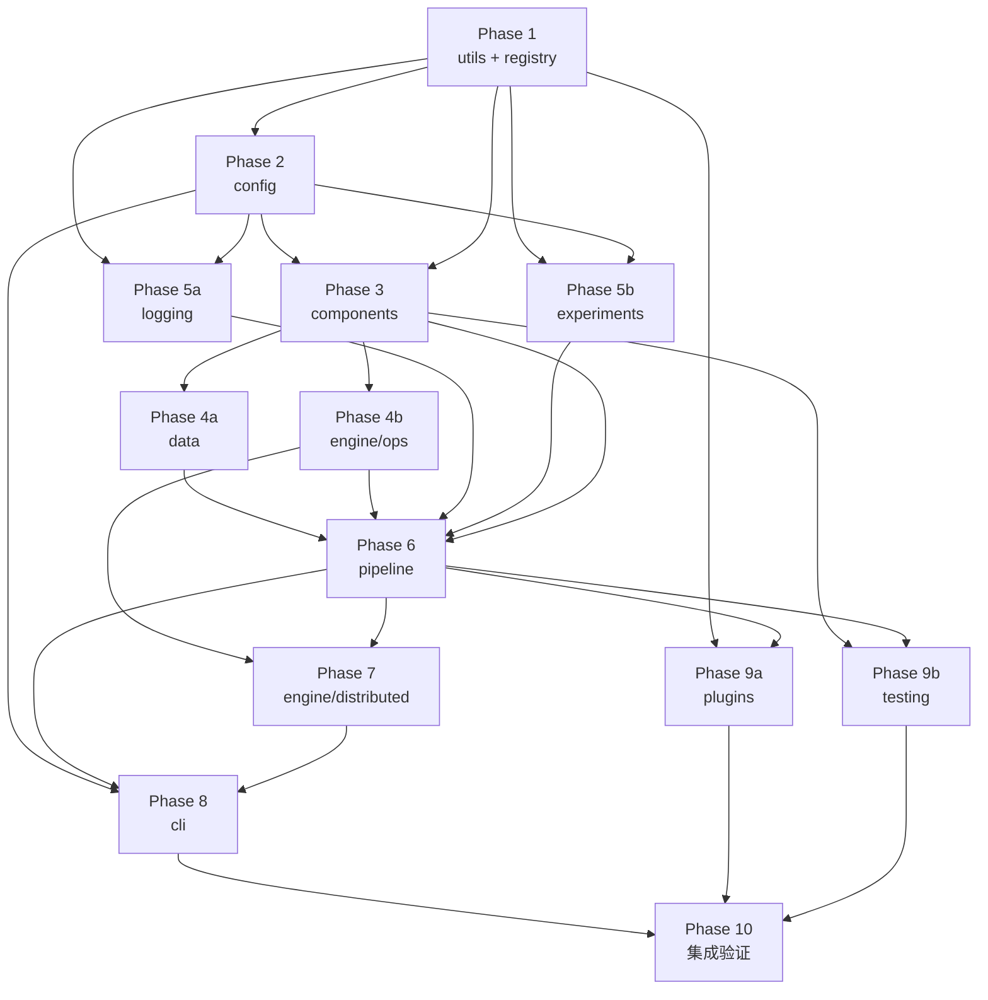

# NameFrame 开发计划

> 基于 `docs/architecture.md` 的技术架构，按照自底向上的依赖顺序，分阶段交付 NameFrame 框架。

注意：开发过程中，应给出所有变量的类型、所有方法/函数的返回类型（无则写 `None`），对所有重要方法、函数和类型给出详细的字符串文档。字符串文档内容包括对重要参数的类型和作用注解（不重要的或显而易见的，只给类型不给作用注释），以及对返回值的类型注解。另外需对必要部分给出简明扼要的注释。字符串文档和注释全用小写开头，英文逗号分隔，英文句号结尾。例如：

```python
class StructuredLogger:
    def __init__(self, config: Config) -> None:
        """
        provides structured logging info.

        Params:
        - `config`: `Config` type.
        """
        self.writers: list[LogWriter] = self._init_writers(config)

    # writes metrics with self.writers.
    def log_metrics(self, metrics: dict, step: int, epoch: int) -> None:
        """
        writes metrics of given step/epoch.

        Params:
        - `metrics`: `dict` type.
        - `step`: `int` type of given step.
        - `epoch`: `int` type of given epoch.
        """
        for w in self.writers:
            w.write_metrics(metrics, step, epoch)

    def log_info(self, msg: str) -> None:
        ...

    def log_warning(self, msg: str) -> None:
        ...

    def log_error(self, msg: str) -> None:
        ...
```

---

## 阶段总览

```
Phase 1   utils + registry        ← 零依赖起点
Phase 2   config                  ← 依赖 utils
Phase 3   components              ← 依赖 registry + config
Phase 4   data + engine/ops       ← 依赖 components（可并行）
Phase 5   logging + experiments   ← 依赖 utils + config（可并行）
Phase 6   pipeline                ← 依赖 components + data + engine + logging
Phase 7   engine/distributed      ← 依赖 engine/ops + pipeline
Phase 8   cli                     ← 依赖所有下层
Phase 9   plugins + testing       ← 依赖 registry + pipeline
Phase 10  集成验证                 ← 全栈端到端
```

**关键原则**：
- 每个 Phase 完成后，该阶段的模块可以独立 import、独立测试。
- 后续 Phase 只依赖已完成 Phase 的公开接口，不依赖内部实现细节。
- 每个 Phase 的入口是 `__init__.py`，导出该模块的公开 API。

---

## Phase 1：基础工具 + 注册表

### 地位

整个框架的**地基**。所有后续模块都依赖 `utils/` 中的类型定义、工具函数，以及 `registry/` 中的注册机制。本阶段零内部依赖，只依赖 Python 标准库和 PyTorch。

### 与后续阶段的联系

| 被依赖方 | 依赖内容 |
|----------|---------|
| Phase 3 (components) | `RegisteredModule` 继承自 `registry`；`Batch` 使用 `utils/typing.py` 的 Protocol |
| Phase 4 (data/engine) | `DataLoaderFactory` 使用 `registry` 内省 dataset 注册项 |
| Phase 5 (logging) | `StructuredLogger` 依赖 `utils/typing.py` 中的类型 |
| Phase 6 (pipeline) | `Trainer` 通过 `registry` 解析组件名称，通过 `registry.get()` 获取组件类 |

### 交付物

```
nameframe/
├── __init__.py
├── utils/
│   ├── __init__.py
│   ├── typing.py       # BatchProtocol, ModelProtocol, LossProtocol, MetricProtocol, DatasetProtocol, FieldSchema
│   ├── seed.py          # set_seed(seed), derive_seed(base_seed, component, rank)
│   └── env.py           # capture_env() → dict
└── registry/
    ├── __init__.py      # 导出 Registry 类和全局实例 (model, dataset, loss, metric, ops, plugin)
    ├── core.py          # Registry 类
    └── discovery.py     # discover(directory) 自动扫描注册
```

### 应实现功能

**`utils/typing.py`**：
- `BatchProtocol`：`data: Tensor`, `target: Tensor | None`, `meta: dict`
- `ModelProtocol`：`forward(batch) → Tensor`, `parameters()`, `state_dict()`, `load_state_dict()`
- `LossProtocol`：`forward(pred, batch) → Tensor`
- `MetricProtocol`：`update(pred, batch)`, `compute() → dict[str, float]`, `reset()`
- `DatasetProtocol`：`fingerprint()`, `transforms(mode)`, `__getitem__`, `__len__`
- `FieldSchema`：`TypedDict(total=False)` 含 `type`, `default`, `help`, `choices`, `range`, `nullable`

**`utils/seed.py`**：
- `set_seed(seed: int)`：设置 Python random、numpy、torch、CUDA 的全局种子
- `derive_seed(base_seed: int, component: str, rank: int = 0)`：使用哈希派生子种子

**`utils/env.py`**：
- `capture_env()`：返回 `{"python": ..., "torch": ..., "cuda": ..., "cudnn": ..., "platform": ...}`

**`registry/core.py` — `Registry` 类**：
- `register(name=None)`：装饰器方法，未指定 name 时自动 `camel_to_snake`
- `get(name)`：按名获取，支持 `"ns:name"` 命名空间语法，不存在时抛 `RegistryKeyError`
- `list_all(namespace=None)`：返回 `dict[str, type]`
- `__contains__(name)`：支持 `name in registry`

**`registry/discovery.py`**：
- `discover(directory: Path)`：递归扫描 `.py` 文件，跳过 `__init__.py`，`import_module` 触发副作用注册

**全局实例**（在 `registry/__init__.py` 中创建）：
```python
model   = Registry("model")
dataset = Registry("dataset")
loss    = Registry("loss")
metric  = Registry("metric")
ops     = Registry("ops")
plugin  = Registry("plugin")
```

### 完成标准

```python
import nameframe

# 注册表可实例化
assert nameframe.registry.model.name == "model"

# 装饰器注册可用
@nameframe.registry.model.register("test_model")
class TestModel: ...

assert "test_model" in nameframe.registry.model
assert nameframe.registry.model.get("test_model") is TestModel

# 不存在的 key 抛异常
try:
    nameframe.registry.model.get("nonexistent")
    assert False, "should raise"
except Exception: pass

# 环境签名可调用
env = nameframe.utils.env.capture_env()
assert "python" in env
assert "torch" in env

# 种子设置无异常
nameframe.utils.seed.set_seed(42)
```

---

## Phase 2：配置系统

### 地位

框架的**配置基础设施**。承载了设计理念 #4（约定优于配置）、#8（不可变配置）、#12（配置是模块的唯一接口）。所有后续需要配置解析、校验、冻结的模块都依赖本阶段。

### 与后续阶段的联系

| 被依赖方 | 依赖内容 |
|----------|---------|
| Phase 3 (components) | `RegisteredModule.from_config()` 调用 `Config.get_namespace()` |
| Phase 6 (pipeline) | `Trainer.__init__()` 接收 `Config`，训练前校验 schema |
| Phase 8 (cli) | CLI 命令调用 `Config.from_yaml(path, overrides)` |

**关键接口**：`Config.from_yaml()` → `resolve()` → `freeze()` 三步模式是 CLI → Pipeline 的数据流起点。

### 交付物

```
nameframe/config/
├── __init__.py
├── schema.py      # FieldSchema, ConfigValidationError
├── loader.py       # Config 类 (from_yaml, resolve, freeze, get_namespace, to_dict)
├── freezer.py      # FrozenConfigError
└── resolver.py     # _resolve_search_vars() ${search:...} 语法解析
```

### 应实现功能

**`config/schema.py`**：
- `FieldSchema` TypedDict：复用 Phase 1 的定义

**`config/loader.py` — `Config` 类**：
- `from_yaml(path: Path, overrides: dict | None = None)`：加载 YAML，处理 `!include` 指令，合并 overrides
- `resolve()`：扫描所有值，解析 `${search:...}` 等特殊变量语法
- `freeze()`：冻结配置对象，拦截后续任何写入
- `is_frozen`：property，返回布尔
- `get_namespace(ns: str)`：用点号路径提取子 dict（如 `"model"` → `{"name": "resnet50", ...}`）
- `to_dict()`：导出纯 dict（用于 checkpoint 快照）

**`config/freezer.py`**：
- `FrozenConfigError(key, location)`：异常携带被修改的字段名和修改来源（文件名+行号）

**`config/resolver.py`**：
- `_resolve_search_vars(config_dict)`：遍历 dict 树，把 `"${search: grid(1, 5, 10)}"` 类型的字符串解析为 `SearchSpace` 标记对象

### 完成标准

```python
# 从 YAML 加载
config = Config.from_yaml(Path("test_config.yaml"))
assert config.get_namespace("model") == {"name": "resnet50", "num_layers": 12}

# 冻结后抛出异常
config.freeze()
try:
    config.model.num_layers = 99
    assert False, "should raise FrozenConfigError"
except FrozenConfigError: pass

# Schema 校验
schema = {"lr": {"type": float, "default": 1e-3}}
_validate_against_schema({"lr": "not_a_float"}, schema)  # 应报配置错误并给出建议
```

---

## Phase 3：组件核心抽象

### 地位

框架**组件层的基石**。定义了 Model、Dataset、Loss、Metric 的最小接口契约（哲学 #9）和与配置系统、注册表的集成方式。后续所有具体模型、数据集、损失函数都继承自本阶段的基类。

### 与后续阶段的联系

| 被依赖方 | 依赖内容 |
|----------|---------|
| Phase 4 (data) | `DataPipeline` 接收 `Dataset`，调用 `transforms(mode)` |
| Phase 6 (pipeline) | `Trainer` 通过 `ModelProtocol`/`LossProtocol`/`MetricProtocol` 约束组件 |
| Phase 8 (cli) | `nfm infer` 调用 `Dataset.transforms(mode="infer")` |
| Phase 9 (testing) | `MockDataGenerator` 读取 `config_schema` 推断 shape |

**关键接口**：`Batch` 是组件间唯一的通信载体。组件不相互引用，只通过 Batch 交换数据。

### 交付物

```
nameframe/components/
├── __init__.py
├── batch.py          # Batch 不可变数据对象
├── base.py           # RegisteredModule 基类
├── model.py          # ModelProtocol 定义
├── dataset.py        # Dataset 基类 (torch Dataset + fingerprint + transforms)
├── loss.py           # LossProtocol 定义
└── metric.py         # MetricProtocol 定义 + MetricBase 基类
```

### 应实现功能

**`components/batch.py` — `Batch`**：
- `dataclass(frozen=True)`：`data: Tensor`, `target: Tensor | None = None`, `meta: dict = {}`
- `to(device) → Batch`：唯一的 device 转换方法，返回新对象

**`components/base.py` — `RegisteredModule`**：
- `config_schema: dict[str, FieldSchema] = {}`
- `from_config(config: Config, namespace: str)`：类方法，从配置命名空间提取参数、校验 schema、实例化
- `_validate_against_schema(params, schema)`：参数校验，提供精确错误提示

**`components/model.py`**：
- `ModelProtocol` 类型定义（已在 Phase 1 定义，此处做 runtime checkable 装饰）

**`components/dataset.py` — `Dataset`**：
- 继承 `RegisteredModule` + `torch.utils.data.Dataset`
- `augmentation_transforms: list = []`（训练专用 transform）
- `fingerprint() → str`：默认实现 = `hashlib.md5(所有文件路径排序 + transform 源码)` 的 hex digest
- `transforms(mode: str = "train") → list`：`mode="infer"` 时排除 augmentation_transforms

**`components/loss.py`**：
- `LossProtocol` 类型定义（已在 Phase 1 定义，此处做 runtime checkable 装饰）

**`components/metric.py`**：
- `MetricProtocol` 类型定义
- `MetricBase`：提供 `update(pred, batch)`, `compute() → dict`, `reset()` 的默认骨架

### 完成标准

```python
from nameframe.components import Batch, RegisteredModule, Dataset

# Batch 不可变
batch = Batch(data=torch.zeros(3, 224, 224))
batch.data[0] = 1          # 不影响 batch.data（但对 tensor 的 in-place 修改技术上可行）
batch2 = batch.to("cuda")  # 返回新对象

# Dataset 基类可用
class MyDataset(Dataset):
    config_schema = {"path": {"type": str, "help": "data path"}}
    augmentation_transforms = [lambda x: x.flip(-1)]

    def __len__(self): return 10
    def __getitem__(self, i): return Batch(data=torch.randn(3, 32, 32))

ds = MyDataset(path="/data")
assert len(ds.transforms(mode="train")) > len(ds.transforms(mode="infer"))
assert isinstance(ds.fingerprint(), str)
```

---

## Phase 4：数据管线 + 加速引擎

### 地位

本阶段拆为两个**可并行开发**的子系统：

- **`data/`**：实现数据管线的流体隐喻（哲学 #3），负责 DataLoader 创建、transform 编排、device placement
- **`engine/ops/`**：实现算子多后端派发（哲学 #13），是框架性能的核心

两者都依赖 Phase 3 的 `Batch` 和 `Dataset`，但互不依赖。

### 与后续阶段的联系

| 被依赖方 | 依赖内容 |
|----------|---------|
| Phase 6 (pipeline) | `Trainer` 通过 `DataLoaderFactory` 创建 loader；通过 `DeviceManager` 做 batch placement；通过 `OpDispatcher` 加速计算 |
| Phase 7 (distributed) | `DistributedStrategy.create_sampler()` 需要 Dataset |
| Phase 10 (集成) | 端到端训练的数据和计算链路 |

### 交付物

```
nameframe/data/
├── __init__.py
├── transforms.py     # Transform 基类
├── loader.py         # DataLoaderFactory
└── pipeline.py       # DataPipeline (组合 Dataset + transforms + DataLoader)

nameframe/engine/
├── __init__.py
├── device.py         # DeviceManager
├── amp.py            # AMPManager
└── ops/
    ├── __init__.py
    ├── registry.py   # Op 专用注册逻辑（复用 registry.Registry）
    ├── dispatch.py   # OpDispatcher + dispatch_backend 装饰器
    ├── compiler.py   # CUDA/C++ 源码 → JIT 编译 + 缓存
    ├── verify.py     # 算子多后端精度对比验证
    └── builtins/
        ├── __init__.py
        ├── activations.py  # gelu, silu, relu 等
        └── attention.py    # scaled_dot_product_attention 等
```

### 应实现功能

**`data/loader.py` — `DataLoaderFactory`**：
- `create(dataset, batch_size, device, strategy=None) → DataLoader`
- 自动处理 collate_fn（组装 Batch）、prefetch、worker 数量

**`data/pipeline.py` — `DataPipeline`**：
- `__init__(dataset, config, mode="train")`：根据 mode 选择 transforms
- 输入输出接口统一（哲学 #3）

**`engine/device.py` — `DeviceManager`**：
- `__init__(config)`：解析设备配置
- `prepare_batch(batch: Batch) → Batch`：唯一的 `batch.to(device)` 调用点（哲学 #14）
- `get_device() → torch.device`

**`engine/amp.py` — `AMPManager`**：
- `autocast_context()`：返回 autocast 上下文管理器
- `scale_loss(loss) → Tensor`：梯度缩放
- `step(optimizer)`：unscale + step + update scaler

**`engine/ops/dispatch.py`**：
- `Backend` 枚举：CUDA, TRITON, CPP, PYTHON
- `BACKEND_PRIORITY`：优先级列表
- `OpDispatcher`：`__call__` → 选择后端 → 加载/编译 → 执行
- `dispatch_backend(**backends)`：装饰器，参数为 `cuda=path, triton=path, cpp=path, python=callable`

**`engine/ops/compiler.py`**：
- `compile_cuda(source_path, arch) → Callable`：nvcc 编译 + 缓存到 `.nameframe/cache/`
- `load_cpp_extension(source_path) → Callable`：torch.utils.cpp_extension.load + 缓存

**`engine/ops/verify.py`**：
- `verify_op(name, test_inputs)`：对已注册算子的所有后端运行同一组输入，对比输出精度（容忍浮点误差 1e-5）
- 返回 `dict[Backend, Tensor]` 供人工审查

**`engine/ops/builtins/activations.py`**：
- 内置 `gelu`（Python + CUDA + Triton 三后端）、`silu`、`relu`

### 完成标准

```python
# DataLoader 产出 Batch 对象
loader = DataLoaderFactory.create(dataset, batch_size=32, device="cuda")
batch = next(iter(loader))
assert isinstance(batch, Batch)
assert batch.data.is_cuda

# OpDispatcher 自动选择后端
result = nameframe.engine.ops.builtins.gelu(torch.randn(1000))
# 在 CUDA 设备上应使用 CUDA 后端，无 CUDA 时 fallback 到 Python

# 多后端验证
results = verify_op("gelu", [torch.randn(1000)])
for backend, output in results.items():
    assert torch.allclose(output, results[Backend.PYTHON], atol=1e-5)
```

---

## Phase 5：日志 + 实验管理

### 地位

本阶段拆为两个**可并行开发**的子系统：

- **`logging/`**：结构化多路日志输出（哲学 #23, #24）
- **`experiments/`**：实验生命周期管理（哲学 #25）

两者依赖 Phase 1 的 `utils/` 和 Phase 2 的 `Config`，但互不依赖。

### 与后续阶段的联系

| 被依赖方 | 依赖内容 |
|----------|---------|
| Phase 6 (pipeline) | `Trainer` 通过 `StructuredLogger` 写日志；通过 `RunCatalog` 创建实验记录 |
| Phase 8 (cli) | `nfm ls-runs`, `nfm compare`, `nfm inspect`, `nfm best` 调用 `RunCatalog` |

### 交付物

```
nameframe/logging/
├── __init__.py
├── logger.py         # StructuredLogger (聚合 writers)
├── metrics.py        # MetricsTracker (accumulate + compute)
└── writers/
    ├── __init__.py
    ├── base.py       # LogWriter ABC
    ├── terminal.py   # TerminalWriter (rich 渲染)
    └── jsonl.py      # JSONLWriter (机器可读)

nameframe/experiments/
├── __init__.py
├── run.py            # RunMeta dataclass
├── catalog.py        # RunCatalog
└── compare.py        # CompareResult + compare_runs()
```

### 应实现功能

**`logging/writers/base.py`**：
- `LogWriter` ABC：`write_metrics(metrics, step, epoch)`、`write_info(msg)`、`close()`

**`logging/writers/terminal.py`**：
- 使用 rich 库：Progress 列、Live metrics 面板、颜色高亮
- `log_every` 控制输出频率

**`logging/writers/jsonl.py`**：
- 每行一条 JSON：`{"step": 1, "epoch": 0, "loss": 2.34, "lr": 0.001, "timestamp": "..."}`

**`logging/metrics.py` — `MetricsTracker`**：
- `update(pred, batch)`：对各 metric 调用 `update()`
- `compute() → dict[str, float]`：对各 metric 调用 `compute()`
- `reset()`：每个 epoch 开始时重置

**`logging/logger.py` — `StructuredLogger`**：
- 管理多个 `LogWriter` 实例
- `log_metrics(metrics, step, epoch)`：分发到所有 writer
- `log_info/warning/error(msg)`：带级别的消息分发

**`experiments/run.py`**：
- `RunMeta` dataclass：`run_id, timestamp, config_snapshot, env_signature, dataset_fingerprint, status, metrics_summary`

**`experiments/catalog.py` — `RunCatalog`**：
- `create_run(config) → run_id`：创建 `.nameframe/runs/<timestamp-id>/` 目录及 `meta.json`
- `list_runs(filter_expr=None) → list[RunMeta]`
- `get_run(run_id) → RunMeta`
- `best(metric, mode="max") → RunMeta`：扫描所有 run 的 metrics_summary

**`experiments/compare.py`**：
- `compare_runs(run_a, run_b) → CompareResult`：对比 config diff + metrics 差异

### 完成标准

```python
# 日志多路输出
logger = StructuredLogger(config)
logger.log_metrics({"loss": 2.3, "acc": 0.45}, step=0, epoch=0)
# 终端显示彩色 metrics 面板，同时 .nameframe/runs/.../metrics.jsonl 写入一行

# 实验编目
catalog = RunCatalog()
run_id = catalog.create_run(config)  # 目录已创建，meta.json 已写入
runs = catalog.list_runs()
assert len(runs) >= 1
best = catalog.best("val_acc", mode="max")
```

---

## Phase 6：编排系统

### 地位

框架的**核心编排层**。Trainer 是用户代码和框架基础设施的接合点，实现了：
- 哲学 #5（渐进式复杂度）：默认训练循环 → 覆写 `training_step()` → 完全自定义循环
- 哲学 #6（穿透 API）：`unsafe_get_raw_*` 系列函数
- 哲学 #16（状态即数据）：`TrainingState` dataclass
- 哲学 #20, #21（训练前验证）：9 项检查清单

这是开发工作量最大的阶段。

### 与后续阶段的联系

| 被依赖方 | 依赖内容 |
|----------|---------|
| Phase 7 (distributed) | `DistributedStrategy` 在 Trainer 初始化时被注入 |
| Phase 8 (cli) | `nfm train` 命令创建并运行 `Trainer` |
| Phase 9 (plugins) | `plugin.on_trainer_created(trainer)` |

### 交付物

```
nameframe/pipeline/
├── __init__.py
├── state.py          # TrainingState dataclass
├── hooks.py          # Callback 基类（12 个 hook 点）
├── callbacks.py      # EarlyStopping, LRSchedulerBridge, ModelCheckpoint, GradientClipping
└── trainer.py        # Trainer 类 + 训练前验证 + 穿透 API
```

### 应实现功能

**`pipeline/state.py` — `TrainingState`**：
```python
@dataclass
class TrainingState:
    epoch: int = 0
    global_step: int = 0
    max_epochs: int = 100
    metrics_history: list[dict] = field(default_factory=list)
    best_metric: float | None = None
    best_epoch: int | None = None
    should_stop: bool = False
```

**`pipeline/hooks.py` — `Callback`**：
- 12 个 hook 点：`on_fit_start/end`, `on_epoch_start/end`, `on_batch_start/end`, `on_before_forward`, `on_after_forward`, `on_before_backward`, `on_after_backward`, `on_checkpoint_save`, `on_checkpoint_load`
- 每个 hook 都有默认空实现，用户仅覆写需要的

**`pipeline/callbacks.py`**：
- `EarlyStopping(patience, metric, mode)`：`on_epoch_end` 中检测，设置 `state.should_stop`
- `LRSchedulerBridge`：`on_epoch_end` 中 `scheduler.step()`
- `ModelCheckpoint(dirpath, monitor, mode)`：`on_epoch_end` 中保存最佳模型
- `GradientClipping(max_norm)`：`on_before_backward` 中 clip grad

**`pipeline/trainer.py` — `Trainer`**：
- `__init__`：注入 model, datasets, loss_fn, optimizer, scheduler, metrics, config, state, callbacks, device_manager, logger, amp_manager, catalog
- `fit() → TrainingState`：主训练循环
- `training_step(batch) → dict`：可覆写（进阶用户）
- `validation_step(batch) → dict`：可覆写
- `_validate_before_training()`：9 项检查（schema, shape, memory, gradient, etc.）
- `unsafe_get_raw_dataloader()`：穿透 API
- `unsafe_get_raw_model()`：穿透 API

**训练循环流程**：
```
fit()
  ├─ _validate_before_training()          # Phase 启动检查
  ├─ run = catalog.create_run(config)      # 创建实验记录
  ├─ _run_callbacks("on_fit_start")
  ├─ for epoch in range(epochs):
  │   ├─ _run_callbacks("on_epoch_start")
  │   ├─ metrics_tracker.reset()
  │   ├─ for batch in train_loader:
  │   │   ├─ batch = device_manager.prepare_batch(batch)
  │   │   ├─ _run_callbacks("on_batch_start", batch, step)
  │   │   ├─ outputs = self.training_step(batch)
  │   │   ├─ _run_callbacks("on_batch_end", outputs, step)
  │   │   └─ logger.log_metrics(step_metrics, step, epoch)
  │   ├─ val_metrics = self._validate_epoch()
  │   ├─ _run_callbacks("on_epoch_end")
  │   └─ if state.should_stop: break
  ├─ _run_callbacks("on_fit_end")
  └─ return state
```

### 完成标准

```python
# Mock 组件跑通完整训练循环
from nameframe.pipeline import Trainer, TrainingState, Callback
from nameframe.components import Batch

class MockModel:
    def forward(self, batch): return torch.randn(2, 10)
    def parameters(self): return [torch.nn.Parameter(torch.randn(10))]
    def state_dict(self): return {}
    def load_state_dict(self, d, strict=True): pass

class MockDataset:
    def __len__(self): return 4
    def __getitem__(self, i): return Batch(data=torch.randn(3, 32, 32))
    def transforms(self, mode="train"): return []
    def fingerprint(self): return "mock"

class MockLoss:
    def forward(self, pred, batch): return pred.sum()

class MockMetric:
    def update(self, pred, batch): pass
    def compute(self): return {"acc": 0.5}
    def reset(self): pass

trainer = Trainer(
    model=MockModel(),
    train_dataset=MockDataset(),
    val_dataset=None,
    loss_fn=MockLoss(),
    optimizer=torch.optim.SGD(MockModel().parameters(), lr=0.01),
    scheduler=None,
    metrics=[MockMetric()],
    config=...,
    state=TrainingState(max_epochs=3),
    callbacks=[],
    ...
)
state = trainer.fit()
assert state.global_step == 6  # 4 items / default batch_size 2 * 3 epochs
```

---

## Phase 7：分布式训练

### 地位

哲学 #15 的工程实现。Trainer 不需要知道分布式细节，策略注入后透明工作。

### 与后续阶段的联系

| 被依赖方 | 依赖内容 |
|----------|---------|
| Phase 8 (cli) | `nfm train --devices 4` 触发分布式初始化 |

### 交付物

```
nameframe/engine/
├── distributed.py    # DistributedStrategy ABC + DDPStrategy + FSDPStrategy + DeepSpeedStrategy
```

### 应实现功能

**`DistributedStrategy` ABC**：
- `setup(config)`：初始化进程组
- `wrap_model(model) → nn.Module`：DDP/FSDP 包装
- `create_sampler(dataset) → Sampler`：分布式采样器
- `reduce_metrics(metrics) → dict`：跨 rank 聚合
- `cleanup()`：销毁进程组

**`DDPStrategy`**（Phase 7 交付）：
- 使用 `torch.distributed.launch` 或 `torchrun`
- `setup()`：`init_process_group(nccl)`
- `wrap_model()`：`DistributedDataParallel(model, device_ids=[local_rank])`
- `create_sampler()`：`DistributedSampler(dataset)`
- `reduce_metrics()`：`all_reduce` 每个 metric 值后取平均

**FSDP 和 DeepSpeed 策略**：本阶段只定义 ABC 和空壳，Phase 10 后按需补充。

### 完成标准

```bash
# 单机双卡训练，用户代码零分布式原语
torchrun --nproc_per_node=2 -m nameframe.cli.main train --config exp.yaml --devices 2
# 训练正常完成，两份 checkpoint 的 metrics 经 all_reduce 一致
```

---

## Phase 8：CLI

### 地位

框架对外的唯一入口（哲学 #2）。所有命令只做参数解析、配置合并、调用下层引擎。

### 交付物

```
nameframe/cli/
├── __init__.py
├── main.py           # Typer app 定义 + 所有命令概要
├── commands/
│   ├── __init__.py
│   ├── init.py       # nfm init <project>
│   ├── train.py      # nfm train
│   ├── eval.py       # nfm eval <ckpt>
│   ├── infer.py      # nfm infer <ckpt> <input>
│   ├── debug.py      # nfm debug
│   ├── profile.py    # nfm profile
│   ├── sweep.py      # nfm sweep
│   ├── test.py       # nfm test <component>
│   ├── ls.py         # nfm ls [modules|runs]
│   ├── inspect.py    # nfm inspect <ckpt|run>
│   ├── compare.py    # nfm compare <run_a> <run_b>
│   ├── vis.py        # nfm vis <loss|model|attention>
│   └── export_env.py # nfm export-env / nfm export-docker
└── autocomplete/
    └── __init__.py   # shell 补全脚本生成
```

### 应实现功能

**`main.py`**：
- Typer app = `typer.Typer(name="nfm")`
- shell 补全自动注册

**`commands/init.py`**：
- 创建项目目录结构（`config.yaml`, `model/`, `dataset/`, `loss/`, `ops/`, `run.py`）
- 模板渲染（默认模板 + 可扩展模板）

**`commands/train.py`**：
- 解析 `--config` 路径
- `Config.from_yaml(path, overrides)` → `resolve()` → `freeze()`
- 注册表解析所有组件名 → `reg.*.get()`
- 实例化组件 → `from_config()`
- 创建 Trainer → `fit()`

**`commands/eval.py`**：
- 加载 checkpoint → 恢复 config + 模型权重
- 重建 Dataset（推理模式）
- 运行验证循环

**`commands/infer.py`**：
- 加载 checkpoint + 复用训练预处理 pipeline（哲学 #26）
- 单/批量推理

### 完成标准

```bash
nfm init my_project
# → 生成 my_project/ 目录含标准骨架

cd my_project
# 至少需要一个真实或 mock 的 model/dataset/loss
nfm train --config config.yaml
# → 训练启动，终端显示 rich 进度条 + metrics

nfm train --config config.yaml --devices 1
# → 单卡训练

nfm eval runs/my_project/latest.pt
# → 输出验证指标

nfm infer runs/my_project/best.pt cat.jpg
# → 输出推理结果

nfm ls runs
# → 列出所有实验

nfm compare <run_a> <run_b>
# → 对比 config + metrics
```

---

## Phase 9：插件 + 测试工具

### 地位

- `plugins/`：框架生态扩展的入口（哲学 #28）
- `testing/`：用户代码质量的保障（哲学 #22）

### 交付物

```
nameframe/plugins/
├── __init__.py
├── base.py           # NameFramePlugin ABC (on_registry, on_config_loaded, on_trainer_created)
└── manager.py        # PluginManager (entry_points 扫描 + 生命周期管理)

nameframe/testing/
├── __init__.py
├── mock.py           # MockDataGenerator
└── runners.py        # ComponentTestRunner
```

### 应实现功能

**`plugins/base.py`**：
- `NameFramePlugin` ABC：
  - `name: str`, `version: str`
  - `on_registry(registry)`：注册自定义组件
  - `on_config_loaded(config)`：验证/补充插件配置
  - `on_trainer_created(trainer)`：注入 callback

**`plugins/manager.py`**：
- `PluginManager.load_all(plugin_names: list[str]) → list[NameFramePlugin]`
- `discover_installed() → list[str]`：扫描 `importlib.metadata.entry_points(group="nameframe.plugins")`

**`testing/mock.py`**：
- `MockDataGenerator(model, dataset)`：
  - `generate(batch_size=2) → Batch`：从 `config_schema` 推断 shape，生成随机 tensor
  - `generate_like(real_batch) → Batch`：复制 shape，生成随机内容

**`testing/runners.py`**：
- `ComponentTestRunner`：
  - `test_model(config)`：shape check → forward → backward → gradient flow
  - `test_dataset(config)`：验证输出 shape + dtype
  - `test_pipeline(config)`：端到端 3 步

### 完成标准

```python
# 插件发现
manager = PluginManager()
manager.load_all(["mock_plugin"])  # 从 entry_points 加载

# Mock 数据
gen = MockDataGenerator(model, dataset)
batch = gen.generate(batch_size=4)
assert isinstance(batch, Batch)
assert batch.data.shape[0] == 4

# 组件测试
runner = ComponentTestRunner(config)
result = runner.test_model(config)
assert result.passed, result.errors
```

```bash
nfm test model --config exp.yaml       # 输出: ✓ shape ✓ forward ✓ backward ✓ gradient
nfm test dataset --config exp.yaml     # 输出: ✓ shape ✓ dtype ✓ batch_size
nfm test pipeline --config exp.yaml    # 输出: ✓ 3 steps completed
```

---

## Phase 10：集成验证

### 目标

端到端验证框架从初始化到训练的完整链路，使用真实的最小项目。

### 验证清单

**1. 项目初始化**：
```bash
nfm init cifar10_demo
ls cifar10_demo/
# config.yaml  model/  dataset/  loss/  ops/  run.py
```

**2. 零配置训练**：
```bash
cd cifar10_demo
nfm train
# 框架自动检测 model/dataset/loss，使用全默认值，跑通 ResNet-18 + CIFAR-10
```

**3. 自定义配置训练**：
```bash
nfm train --config my_experiment.yaml
# 加载用户配置，覆盖默认值
```

**4. 调试模式**：
```bash
nfm debug --config my_experiment.yaml
# 单 batch、详细日志、NaN 检测、--no-freeze
```

**5. 评估与推理**：
```bash
nfm eval .nameframe/runs/latest/checkpoints/best.pt
nfm infer .nameframe/runs/latest/checkpoints/best.pt sample.jpg
```

**6. 实验管理**：
```bash
nfm ls runs
nfm compare <run_a> <run_b>
nfm best --metric val_acc
```

**7. 超参搜索**：
```bash
nfm sweep --config exp.yaml --trials 10 --workers 2
```

**8. 分布式训练**：
```bash
nfm train --config exp.yaml --devices 2
```

**9. 组件测试**：
```bash
nfm test model --config exp.yaml
nfm test dataset --config exp.yaml
nfm test pipeline --config exp.yaml
```

**10. Checkpoint 恢复**：
- 中断训练后 `nfm train --resume` 从最新 checkpoint 继续

### 完成标准

以上 10 项全部通过，框架可发布 v0.1.0。

---

## 附录：各 Phase 依赖关系 Mermaid 图



---

*开发过程中，每完成一个 Phase，应在 Phase 完成后更新本文档的完成状态，并确保所有下层 Phase 的公开接口不被破坏。*
